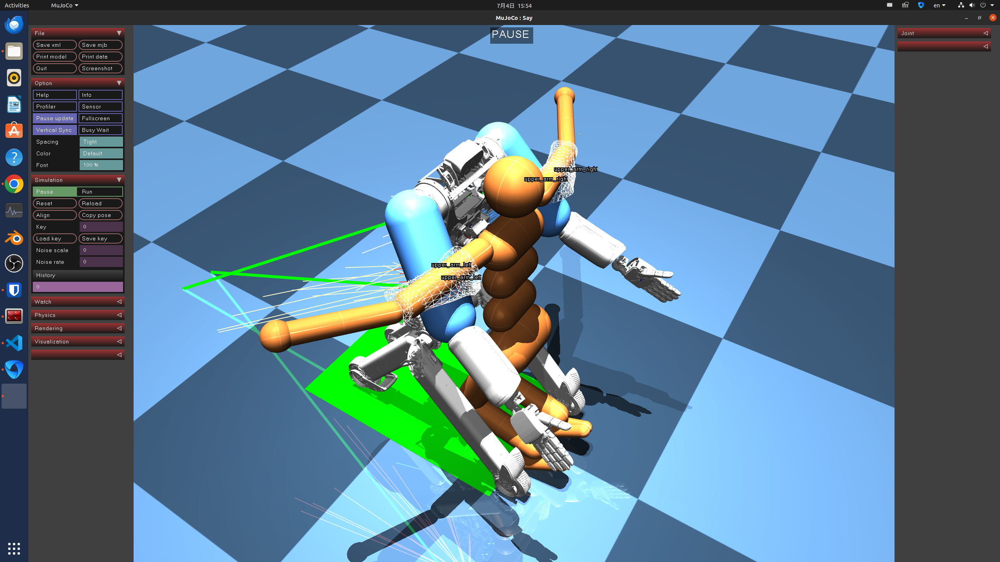

# MuJoCo-private软体仿真插件系统开发、使用文档

## 仿真使用整体流程

1. 安装biulab的算法库（作用：提供仿真支持，和可视化工具，课题组内部工具）
2. 安装MuJoCo的Python包（插件版本，用于机器人训练仿真）
3. 机器人正常训练/使用插件训练（除了mujoco本身的仿真之外，可以获得触觉力）
4. 真机部署和落地推理实验验证

**系统环境要求**

- Ubuntu 20.04
- G++-9.4，GCC-9.4，cmake 3.23+
- Python 3.11
- MuJoCo 3.1.6， mjx 3.1.6

> 已经打包好的文件获取地址: ./packages

## 1. 安装算法库获得仿真算法库biulab的支持

```bash
# 下载安装biulab的安装包, 将会给系统安装仿真的算法库和仿真可视化软件（供测试）
sudo dpkg -i biulab_2.14.*+Ubuntu2004_amd64_Release.deb

# 命令行直接运行测试
PolyTools 

# 如果出现下列语句则表示算法库安装成功
Exit for avoid ovrerwrite.
15:06:12 [SUCCEED] Application: biulab©elonkou-v2.14.8-Releaseis launched (without viewport).
15:06:12 [SUCCEED] Application: biulab©elonkou-v2.14.8-Release is terminated.

# 【可选】运行Phy3DDemo验证，仿真界面来可视化仿真测试（biulab是课题组内部工具）
Phy3DDemo
```

## 2. 安装机器人训练和运行系统环境，（可选，，主要是安装Python环境，和用于训练测试）

```bash
# Clone xiaowu环境并且安装
git clone https://github.com/ZzzHhh21/xiaowu

# 按照xiaowu创建依赖环境，假设环境为tencent
```

## 3. Python环境下仿真训练，需要替换带有插件的MuJoCo-private的Python包

```bash
# python 3.11环境，如果需要其他Python版本的包，则需要重新打包（参照下一条）
# 在tencent环境下，获取python包并且安装
pip install mujoco-*-cp311*.whl
```

## （可选）MuJoCo-UnifX插件的开发编译和打包，在C++环境下直接仿真测试

```bash
# clone MuJoCo-private程序包
git clone https://github.com/ElonKou/mujoco_private

# 拉取所有分支代码，并且切换到private316分支（该分支分叉自mujoco3.1.6）
git checkout private316

# 安装开发编译依赖库
sudo apt-get install libxinerama-dev libxcursor-dev libxi-dev

# 344和316版本插件库的名称存在冲突，切换版本后需要手动删除
rm -rf ./build/lib/libsdf*

# 直接编译c++的mujoco插件，测试是否正常运行
./run.sh

# 启动C++可执行程序，检查是否运行成功
./build/bin/simulate model/plugin/simplesoft/soft2.xml
# 或者执行软体仿真代码，仿真的场景见下图，两者图像一样
./build/bin/simulate /home/ian/fudan/mujoco_private/model/plugin/robots/xiaowu_soft_old.xml
```



## (可选) 编译python包、使用python中加载仿真场景并且获得力学信息的案例
```bash
# [optional] 编译打包python
# 首选切换到mujoco目录，激活tencent conda环境（理论上只需要python 3.11环境）
# 执行编译打包脚本
source build_whl.sh

# 备注：如果出现python/dist biuld错误，则需要删除python/dist中的内容，重新编译（建议手动执行每条命令来测试）
# 备注：当前编译缓存机制有问题，每次都要重新下载代码，建议在c++端运行检查OK之后，统一打包

# 打包之后的whl在python/dist文件夹内

# 检查python插件运行状态和触觉力获取信息
python example.py
```

## 4. 机器人获得触觉力和并且在训练中使用

```python
# 调用mujoco插件获得触觉力用于训练
# 参考 mujoco_private中的example.py文件

nstate = model.plugin_statenum[j]
stateadr = model.plugin_stateadr[j]
plugin_state = data.plugin_state[stateadr: stateadr + nstate]
forces = np.array(plugin_state).reshape((2, 214,  3))

# 备注，其中触觉力维度： 2 *214 * 3，分别是左侧胳膊，和右侧胳膊的214个触觉点阵的力学
```

## 5. 软体模型构建和仿真配置
对于人体等物理仿真模型，构建软体模型（区分刚体和软体），并且进行软体接触力学仿真的主要流程是：

1. 构建软体模拟模型：可以使用皮肤和骨骼obj模型，然后合并成一个mesh结构，并且构建四面体网格模型（注意：内部刚体骨头设置标记为2， 外部软体标记为1），构建仿真模型（参考附录1）
2. 生成仿真的几何模型(tet,ele,face,edge)：使用tetgen，具体使用命令: `./tetgen -pAqz files/sphere_ok.poly`
3. 写一个仿真的yaml参数文件，放到biulab的安装目录中，具体配置（参考附录2）
4. Phy3DDemo中LoadConfigs进行加载，然后点击仿真测试
5. 如果仿真可以正常运行，则可以在MuJoCo中加载新的模型进行训练
6. 如果需要：刚体-软体绑定，参考MuJoCo的参考实现，插件相关的代码目录（参考附录3）


## 附录1：tetgen软体模型格式说明
```bash
# 目的：构建ploy文件，然后使用tetgen划分具体仿真模型(tet,ele,face,node)
# 具体需要构建的ploy模型格式见：/usr/share/biulab/files 中的*ploy文件，（需要安装biulab，就可以查看安装到系统目录的文件）
# ploy格式介绍：https://wias-berlin.de/software/tetgen/1.5/doc/manual/manual006.html


# 例如：/usr/share/biulab/files/sphere_ok.poly 文件
# Part 1 - node list
# <# of points> <dimension (3)> <# of attributes> <boundary markers (0 or 1)>
11592 3 0 1
# <point #> <x> <y> <z> [attributes] [boundary marker]
1 -0.475918 -0.372824 0.581247 1   # 最后一个标记是1: 表示外层的软体的顶点
2 -0.550683 -0.310672 0.550779 1
3 -0.516894 -0.414516 0.520068 1
4 -0.578134 -0.37329 0.478961 1
5 -0.550683 -0.310672 0.550779 1
6 -0.602296 -0.301602 0.498799 1
...
7695 0.249575 -0.18574 -0.398026 2 # 最后一个标记是2: 表示内层的刚性的顶点
7696 0.177435 -0.107668 -0.456562 2
7697 0.109682 -0.175572 -0.456769 2
7698 0.106899 -0.109351 -0.477764 2
7699 0.111344 -0.275246 -0.406601 2
...
```

## 附录2：仿真的模型配置文件yaml
```bash
# 创建新的仿真文件
vim /usr/share/biulab/config/new_name.yaml


# 参照以下信息写入yaml文件
name: sphere_2layers_better
info: contains 2 layers' sphere, for soft body simulate, doesn't use flobal distance constarints.
physics:
  dt: 0.016      # 仿真步长
  sub_steps: 10  # 迭代求解次数
  phy_run: false # 是否运行仿真
  use_sep_steps: false # whether to use separate steps for collision and physics
  gravity: [0, -9.8, 0]   # 重力加速度，右手坐标系，向上是y轴+
  restitution: 0.5        # 反弹衰减系数
  show_debug: false
scene:
  has_surface: false      # 是否在仿真之后进行蒙皮平滑
  surface_mesh: none      # 蒙皮的obj模型路径
  scene_path: sphere_ok.1 # 【替换系的文件】仿真的tet,ele,edge,node的公共名称，系统会默认从安装的/usr/share/biulab/files中加载
  scale: 1                # 加载时候缩放xyz系数
  has_texture: false      # 是否有表面贴图
  apply_transform: true   # 是否应用scale, ros, pos 的变换
  pos: [0, 4, 0]
  rot: [0, 0, 0]
  border: [-5, -5, -5, 5, 5, 5]     # 仿真的边界 [-x, -y, -z, +x, +y, +z]
  inner_fixed: false                # true: 表示中间标记为2的刚体不会发生运动，会一直停留在空中，拥有无穷的刚度
  mesh_obstacle: false
  collision_type: 0 # CUPHY_COLL_VERTEX_SDF    # 碰撞方法，设置为1一般来说最好，0表示不处理碰撞
  constraints:          # 以下是，各种约束和约束的启用方式
    global_dist:        # 距离约束          
      valid: false
      comp: 0
    inner_volume:
      valid: true
      comp: 0.0001
    outer_volume:
      valid: true
      comp: 0.0153
    inner_hard:
      valid: true
      comp: 0.0001
    cross_dist:
      valid: true
      comp: 43.65
    direct_dist:
      valid: true
      comp: 1.612
    vol_fem:
      valid: false
      comp: 0.1
    barrier_soft_rigid:
      valid: false
      comp: 0.000001
  motion:
    has_motion: false
    reverse_xz: false
display:                # 显示参数
  disp_layertet: false
  disp_level: 5
  axis: 2
  max_level: 10

```

## 附录3：仿真插件实现代码
```bash
# 插件实现代码
plugin/simplesoft

# 使用插件的仿真模型
model/plugin/simplesoft
model/plugin/robots

```
